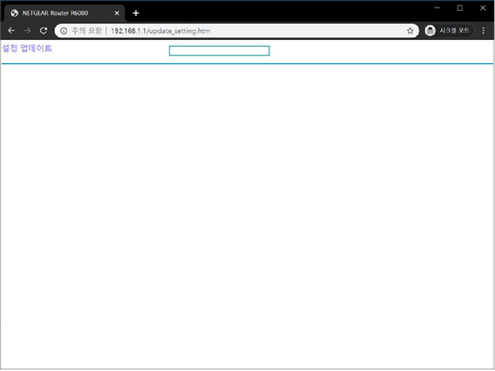
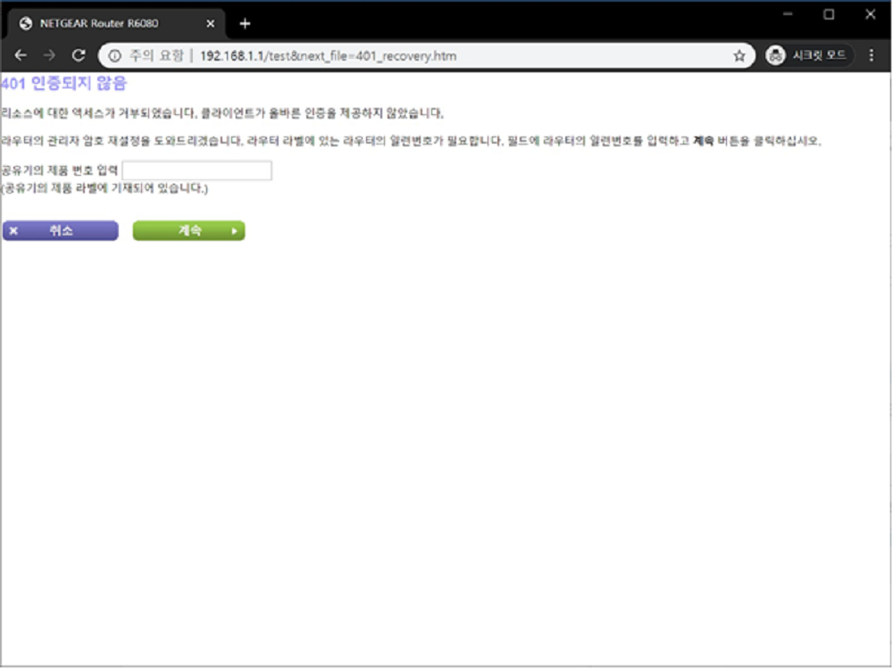
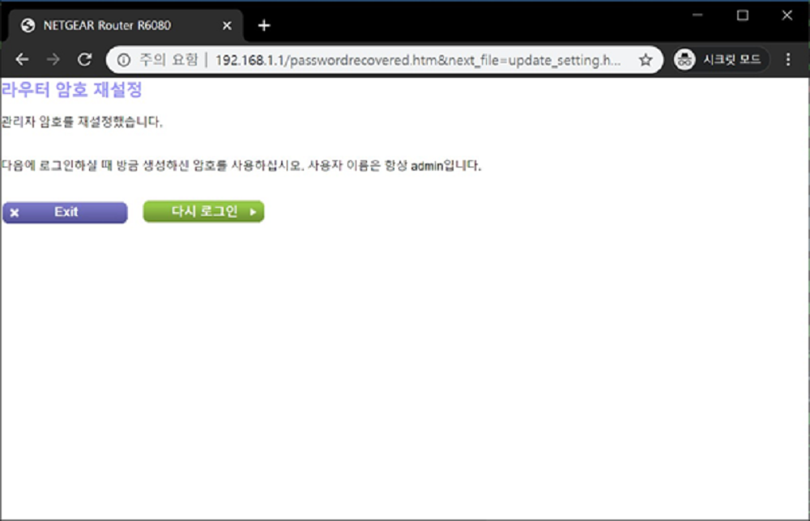
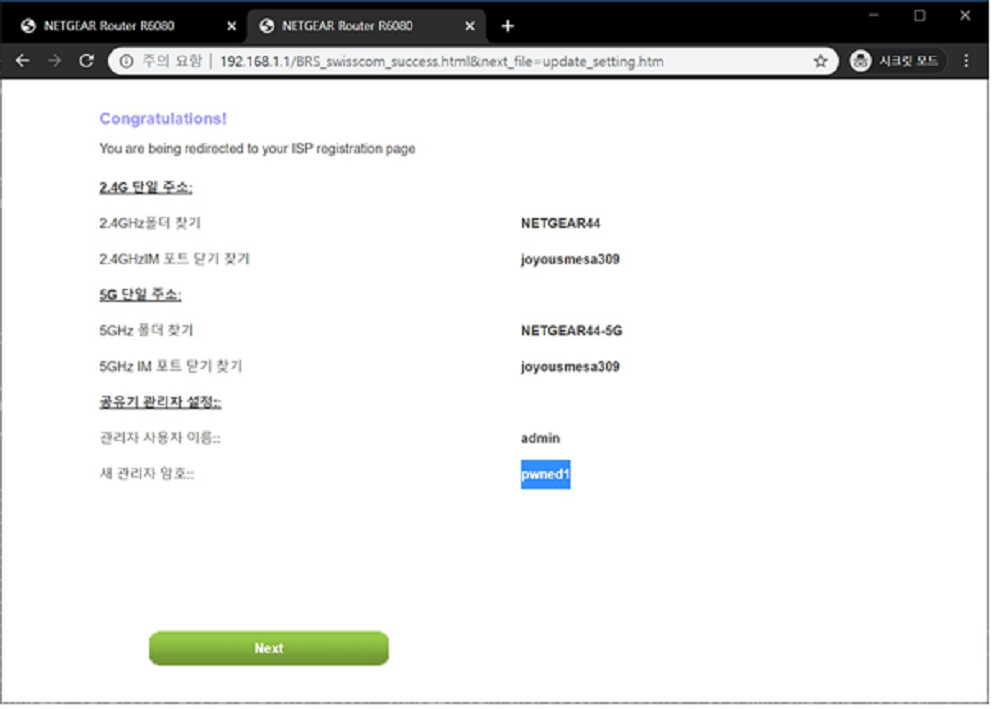

# Introduce

First i may also have awkward English writing. please understand.
This vulnerability has been assigned CVE-2020-17409 and ZDI-CAN-10754. 
Similar bugs existed 3 years ago (vulnerabilities reported from geekpwn and report 2018 from shanghai geekpwn), and the patching method on netgear did not address the root cause of the vulnerability.

And it was affected on the following devices:
R6260(1.1.0.62 or previous version), 
R6220(1.1.0.92 (hot fix) or previous version), 
R6120(1.0.58 or previous version), 
R6080(1.0.0.42 or previous version), 
R6020(1.0.0.42 or previous version), 
JNR3210(1.1.0.30 or previous version), 
WNR2020(1.1.0.62 or previous version) 

# Vulnerabilities 

## HTTP Auth Bypass

mini_httpd is the binary that handles the user's request. There is some logic in this binary that is responsible for Auth, which is vulnerable. That is related to the next two variables: 

```c
static int need_auth = 1; 
... static char *no_check_passwd_paths[] = { "currentsetting.htm", "update_setting.htm", 
 	"debuginfo.htm", "important_update.htm", "MNU_top.htm", 
// 	"warning_pg.htm","debug.htm", 
    "warning_pg.htm", 
 	"multi_login.html", "401_recovery.htm", "401_access_denied.htm", 
 	"BRS_netgear_success.html", "BRS_top.html", "BRS_miiicasa_success.html", 
 	NULL 
}; 
```

**need_auth** value indicates whether authentication is required. However, the no_check_passwd_paths[] array does not require auth when user request that htm list. Let's see more: 

```c
if (path_exist(path, no_check_passwd_paths, method_str) || (strstr(path, 
"htpwd_recovery.cgi") && strcasecmp(method_str, get_method_str(METHOD_POST)) == 0) #ifdef PNPX 
    || (strstr(path, "PNPX_GetShareFolderList")) 
#endif 
    ) 
{ 
 	need_auth = 0; 
 	... 
} 
```

And here is some code for path_exist(): 

```c
for (i = 0; paths[i]; i++) 
{ 
 	if (strstr(path, paths[i])) 
 	{ 
 	 	SC_CFPRINTF("not need auth since %s is part of %s\n", paths[i], path); 
 	 	return 1; 
 	} 
} 
```

As you can see, requesting no_check_passwd_paths (e.g update_setting.htm) does not require authentication.  



There is one problem. by default, netgear uses cgi to handle user requests, so we have to devise a way to use it together. Here is the fun part. If you send a request as follows, mini_http will recognize the request as if it were sent by cgi.



I used this to test again with update_setting.htm in the next_file argument. 



as you can see that we can bypass auth now! 

Many routers may show their settings after setup. (e.g password) In this case, this may not be a problem, but in netgear makes it easy to control the router by linking it with the vulnerability first described.  

For R6080, you can get the password from BRS_swisscom_success.html. Let's use it with the first described vulnerability to get a password. and on other devices, you can get the password from BRS_success.html.



pwned1 is my router password. 
